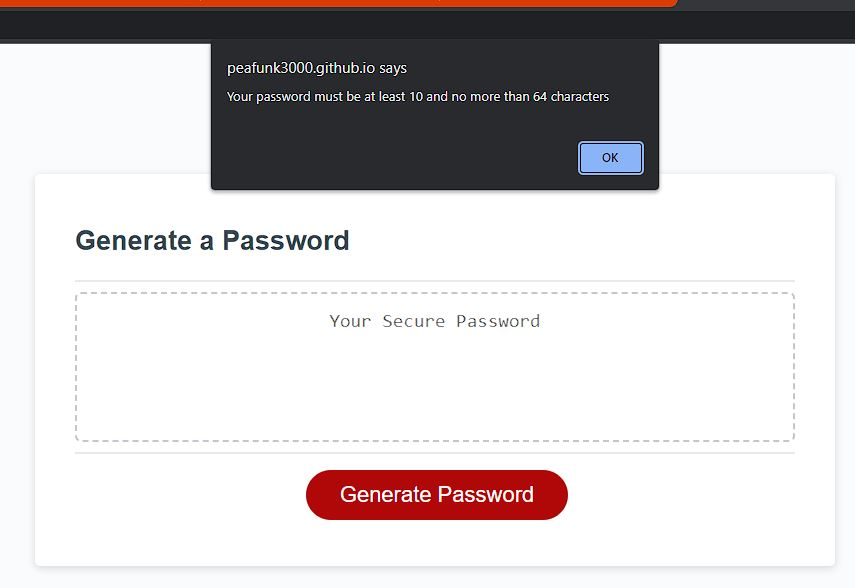

# prompted-password-generator
A random password generator, based on JS prompts for user input regarding password criteria.

## Description

The following image shows the web application's appearance and functionality:
 

 

This project creates an application that an employee can use to generate a random password based on criteria they’ve selected - password length and character type(s) - which are defined by the user via a series of JavaScript prompts. This app will run in the browser, and will feature dynamically updated HTML powered by JavaScript code. 

The application:

* Generates a password when the button is clicked
  * Presents a series of prompts for password criteria:

    * Length of password
      * Alerts at least 10 characters but no more than 64, initially and if a value outside of this range is inputted

    * Character types
      * Lowercase
      * Uppercase
      * Numeric
      * Special characters ($@%&*, etc)
        * Alerts at least one character type must be selected, initially and if no character types are selected by the user

  * As such the code validates for each input and at least one character type should be selected

  * Once prompts are answered the password is generated, shuffled to randomise the character order, and displayed in the page interface i.e. written to the page

## Table of Contents

- [Installation](#installation)
- [Usage](#usage)
- [Credits](#credits)
- [License](#license)

## Installation

N/A

## Usage
Simply follow the series of user input-prompts to generate a randomised password based on your selected criteria.
The page is deployed via GitHub pages:
 
https://peafunk3000.github.io/prompted-password-generator/
 

The repository for this project can be found on my GitHub:
 
https://github.com/PeaFunk3000/prompted-password-generator/
 

## Credits

N/A

## License

MIT License

